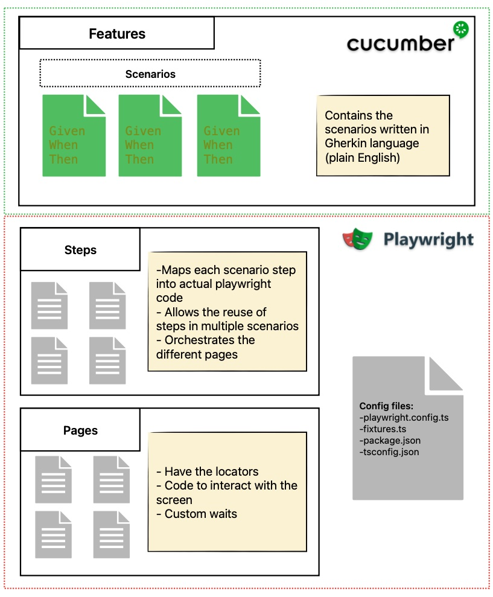
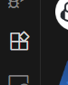
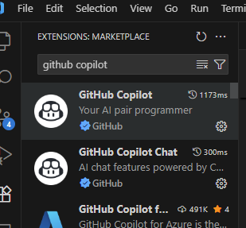
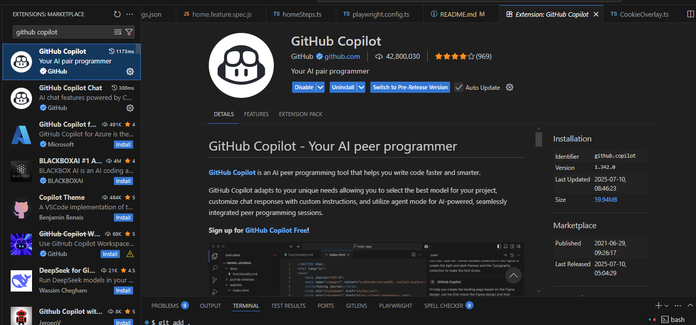
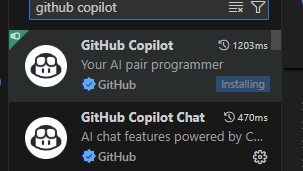
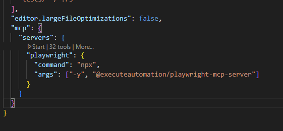

# playwright_demo
Project showcasing the main features of playwright

# Architecture




# Installation
```bash
#Install dependencies
npm install .
#Install playwright
npx playwright install
#generate the tests based on the feature files
npx bddgen
```

# Initial setup
Create a file named `.env` on the root of the repo and define the variable "BASE_URL" to the base url for the application you want to test
```bash
BASE_URL=<URL_FOR_HOME_PAGE>
```

### Running the tests on a specific browser (by default they are executed in parallel)
```bash
npx playwright test --project chromium
```

### Running specific feature
```bash
$env:FEATURE="Playwright/features/name_of_feature.feature"; npm run test:feature
```

### Filtering by tags
```bash
npx playwright test -g @smoke --project chromium
```

### Running tests in debug mode
```bash
npx playwright test --debug --project 'chromium' -g @customize
```

### Different browsers
```bash
npx playwright test --project webkit -g @smoke
```

### Emulate devices browsers
```bash
npx playwright test --project 'Mobile Safari' -g @smoke
npx playwright test --project 'Mobile Android' -g @smoke
```

### Additional reporters
#### HTML Report
```bash
export PLAYWRIGHT_HTML_OPEN=always
npx playwright test --project 'chromium' -g @vehicle_navigation --reporter=html
```
#### JUnit report
```bash
export PLAYWRIGHT_JUNIT_OUTPUT_NAME=results.xml
npx playwright test --project 'chromium' -g @smoke --reporter=junit
```

### Enable trace
```bash
export PLAYWRIGHT_HTML_OPEN=always
npx playwright test --project 'chromium' -g @smoke --reporter=html --trace on
```

### Running the test using the Playwright UI
```bash
npx playwright test --ui
```

## Installing GitHub Copilot in Visual Studio Code

1. **Open Visual Studio Code.**

2. **Go to the Extensions view:**
   - Click the Extensions icon on the Activity Bar on the side of VS Code  
   
     

3. **Search for "GitHub Copilot":**
   - In the Extensions search bar, type `GitHub Copilot`  

     

4. **Install the extension:**
   - Click on the "GitHub Copilot" extension from GitHub and then click the **Install** button 

     

5. **Sign in with your GitHub account if prompted.**

### Installing GitHub Copilot Chat

1. **Go to the Extensions view in Visual Studio Code.**
2. **Search for "GitHub Copilot Chat":**
   - In the Extensions search bar, type `GitHub Copilot Chat`.
3. **Install the extension:**
   - Click on the "GitHub Copilot Chat" extension from GitHub and then click the **Install** button.

   - 

4. **Sign in with your GitHub account if prompted.**

## Playwright MCP Installation and Setup

1. **Install Playwright MCP Server as a dev dependency:**
   ```bash
   npm install --save-dev @executeautomation/playwright-mcp-server
   ```

2. **Configure MCP in your VS Code settings:**
   - Open (or create) `.vscode/settings.json` or your global `settings.json`.
   - Add the following configuration:
     ```jsonc
     "mcp": {
       "servers": {
         "playwright": {
           "command": "npx",
           "args": ["-y", "@executeautomation/playwright-mcp-server"]
         }
       }
     }
     ```
   - Example (VS Code settings):

     

   - In this project, this is already set in your global/user `settings.json`.

3. **Start the MCP server (if not started automatically by your tools):**
   ```bash
   npx @executeautomation/playwright-mcp-server
   ```
   - Or, simply use the MCP features in VS Code and the extension will start the server as needed.

4. **Usage:**
   - Once installed and configured, you can use Playwright MCP features (such as site navigation, DOM inspection, and code generation) directly from your VS Code environment.

## Agents vs MCP: What’s the Difference and Why It Matters

**MCP (Model Context Protocol):**
- MCP is a protocol and server that enables tools (like Playwright) to interact with your application in a structured, automated way.
- It provides a set of APIs for navigation, DOM inspection, code generation, and more, allowing for deep integration with your test environment.
- MCP is typically used as a backend service that powers advanced automation and code generation features in your IDE or CI/CD pipeline.

**Agents:**
- Agents are intelligent, task-oriented assistants that use MCP (or similar protocols) to perform complex workflows.
- An Agent can understand high-level goals (like “generate a test for this scenario”), break them down into steps, and use MCP to interact with your app, gather information, and generate code.
- Agents are designed to be adaptive, context-aware, and capable of making decisions or iterating based on feedback.

**Key Differences:**
- **MCP** is the protocol/server that exposes automation capabilities.
- **Agents** are the “brains” that use MCP to accomplish user goals, orchestrating multiple steps and adapting as needed.
- Think of MCP as the “toolbox” and Agents as the “skilled worker” who knows how to use the tools to get the job done.

**Why It Matters:**
- Using MCP alone gives you powerful automation APIs, but you must script or control them directly.
- Using Agents (powered by MCP) lets you describe your intent in natural language and have the Agent handle the details, making automation more accessible and productive.

*For more details, see [Agents vs MCP: What’s the Difference and Why It Matters](https://medium.com/@shashank_shekhar_pandey/agents-vs-mcp-whats-the-difference-and-why-it-matters-ae4ca704c16b).*

## Including instructions.md for an Agent

To provide custom guidance to an agent (such as for Playwright MCP or Copilot), you can include an `instructions.md` (or `.instructions.md`) file. This enables the agent to follow your workflow, coding standards, and automation rules.


1. **Create the Instructions File:**
   - Name your file `instructions.md` or `<agent_name>.instructions.md`.
   - Place it in a location accessible to your agent (commonly in a `prompts/` or the project root directory).

2. **Write Clear Instructions:**
   - Use markdown format.
   - Specify the agent’s role, capabilities, and any rules or best practices.
   - Example:
     ```markdown
     ---
     applyTo: '**'
     ---
     You are a playwright and cucumber BDD test generator...
     ```

3. **Reference the Instructions in Your Agent Setup:**
   - Most agent frameworks or MCP-based tools automatically detect `.instructions.md` files in standard locations.
   - If manual configuration is needed, specify the path to your instructions file in the agent’s settings or initialization code.

4. **Restart or Reload the Agent:**
   - After adding or updating the instructions file, restart the agent or reload your IDE/extension to ensure the new instructions are loaded.

5. **Verify Agent Behavior:**
   - Test the agent by giving it a relevant task.
   - Confirm it follows the custom instructions (e.g., reviews the project, avoids code duplication, uses MCP tools, etc.).

#### Example Directory Structure
```
Playwright/
  prompts/
    copilot-instructions.instructions.md
  features/
  steps/
  pages/
```

#### Tips
- Use comments and sections in your instructions for clarity.
- Update instructions as your workflow or requirements change.
- For MCP agents, instructions are typically picked up automatically if placed in the right directory.
